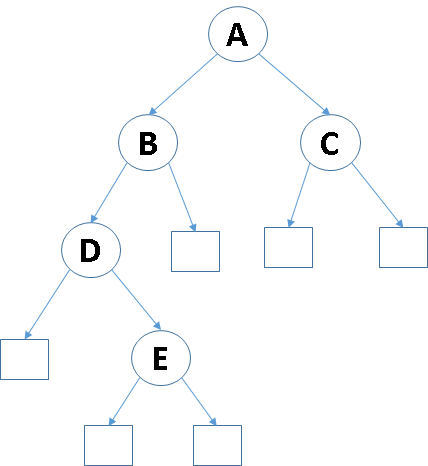

# Introducción

Esta tarea busca evaluar la construcción y manipulación de árboles binarios.
En particular, se debe crear un programa que al recibir el recorrido de un árbol en postorden,
imprima el mismo árbol, pero esta vez recorrido en preorden.

Por ejemplo, dado un `string` como el siguiente:

```
. . . E D . B . . C A
```

se debe generar este _output:_

```
A B D . E . . . C . .
```

Ya que son respectivamente los recorridos en postorden y preorden del árbol de la figura 1:

{ width=40% }

La estrategia seguida para solucionar este problema se describirán en la sección "[Diseño de la Solución]"
y los detalles de su implementación serán explicados en la sección "[Implementación]"

# Diseño de la Solución

Es claro que para convertir el recorrido en postorden de un árbol en un recorrido en preorden,
la forma más clara de hacerlo es primero generar el árbol a partir del recorrido en postorden,
y luego teniendo este árbol, se debe imprimir recorriéndolo en preorden.
El primero de estos pasos es naturalmente traducido a una función con firma

```java
Nodo generaArbol(String postorden)
```

y el segundo a una función con firma

```java
String generaPreorden(Nodo raiz)
```

## Generación del Árbol

Una forma de implementar la función `generaArbol` es usar una pila y luego iterar por los elementos del string.
De esta manera, se puede crear el árbol si se se hace lo siguiente para cada elemento:

- Si es un punto, añadir un nodo externo a la pila.
- Si es una letra, se sacan dos nodos de la pila y se crea un nuevo nodo con la letra como valor y los nodos sacados como hijos. Luego este nuevo nodo se añade a la pila.

Al terminar de leer el string, si éste es un recorrido en postorden válido, se debería haber generado el árbol correspondiente en el primer y único lugar de la pila.

Es conveniente implementar la pila usando una lista enlazada ya que ello permite que la pila no tenga un límite de tamaño apreciable.

# Implementación


# Anexo: Código